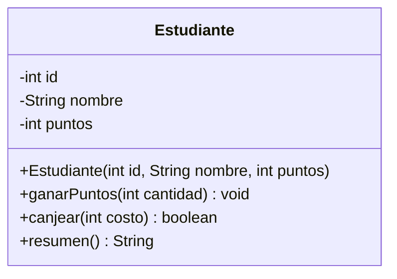

# Diagrama de clases

```mermaid
classDiagram
class Estudiante {
  -int id
  -String nombre
  -int puntos
  +Estudiante(int id, String nombre, int puntos)
  +ganarPuntos(int cantidad) void
  +canjear(int costo) boolean
  +resumen() String
}
```
